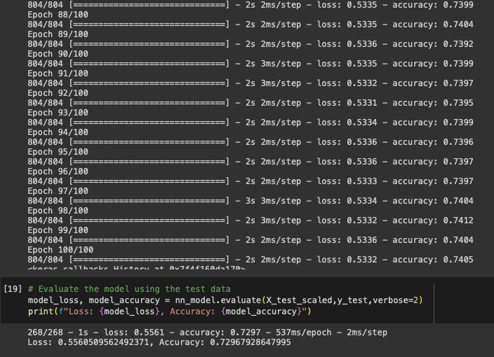

# Neural Network Alphabet Soup Analysis

## Overview

The aim of this analysis is to determine which applicants would be most successful when funded by Alphabet Soup. The dataset is a csv file with +34,000 organizations that had received funding from Alphabet Soup over the years. The dataset included columns, identification, application type, industry sector, government organization classification, use case for funding, organization type, and others. Neural network models incorporated with Scikit-Learn, Tensorflow and StandardScaler were used for the analysis.

## Results

## Data Preprocessing

* Column "Is Successful" had a value of 1 if the funding was used effectively and a value of 0 if it wasn't. This was used as the target variables.
* Columns 'Application Type", "Affiliation", "Classification", "Use case", "Organization", "Income Amount", "Special Considerations" and "Ask Amount" were used as feature variables.
* The EIN and NAME identification columns were dropped as they do not aid the model training.

## Compiling, Training and Evaluating the Model

* The highest performing model used three hidden layers, 160, 30 and 10 respectively. The activation functions started with relu followed by three sigmoid. After iterating with varying number of bins and nodes, interplay of activation functions and increasing hidden layers, the best results tested came from the above tuning selections. 
* The highest model accuracy achieve was 72.97% with a loss of 55.61%. The target model accuracy of 75% was not achieved. 

## Summary

Looking forward to next steps, combing through the data could help remove outliers and less relevant data. If available, increasing the amount of quality data is also an option. Consistently low accuracy results despite multiple iterations of the neural network model may suggest a new approach is needed altogether. Support Vector Machine (SVM) is a likely candidate to improve performance. They can be more effective with high-dimensional spaces, less prone to overfitting and does not converge on local minima. 
